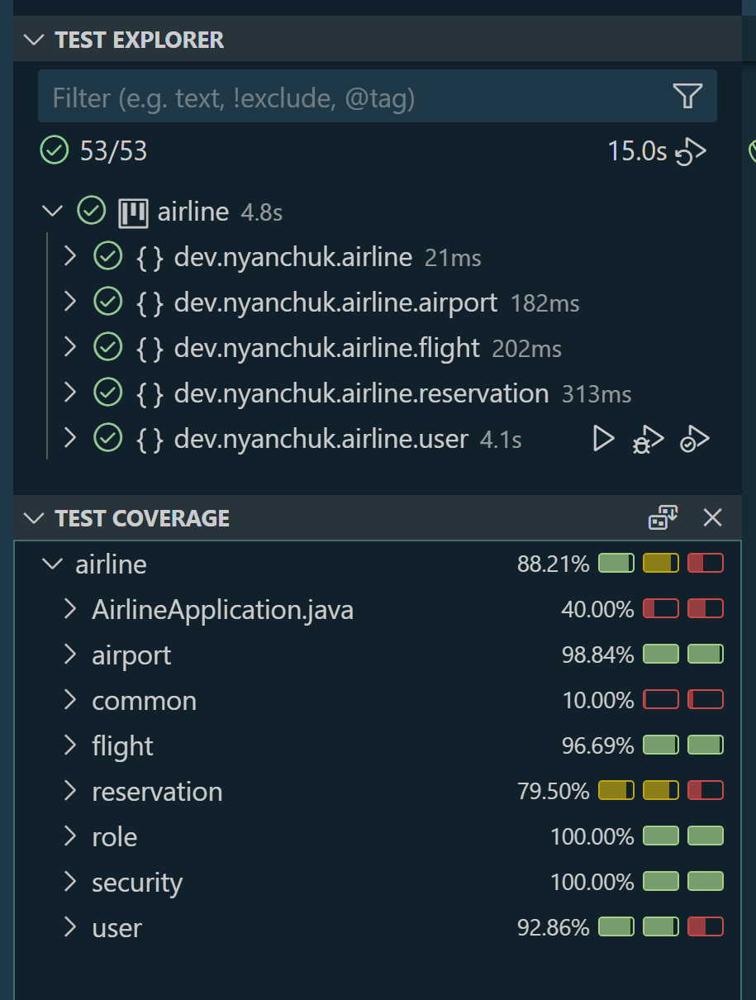
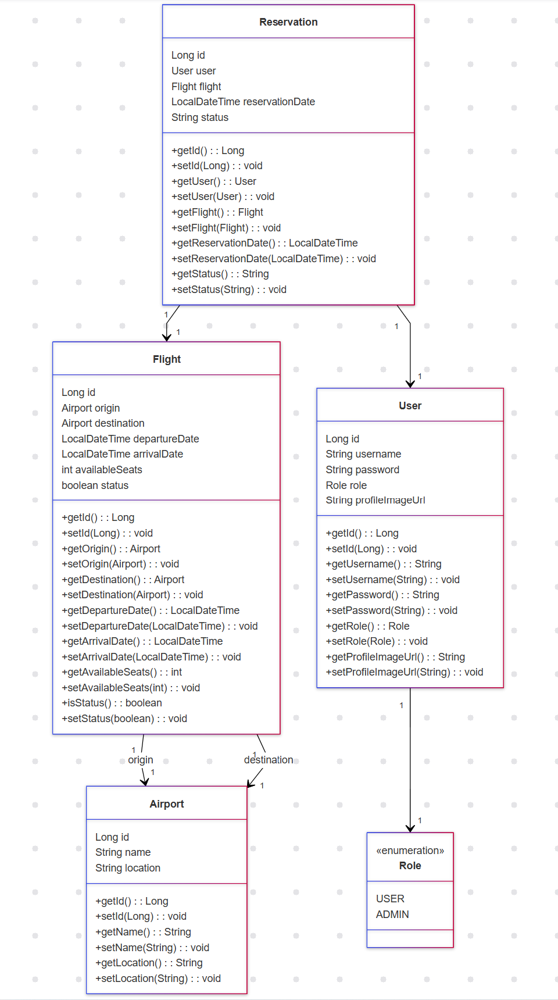
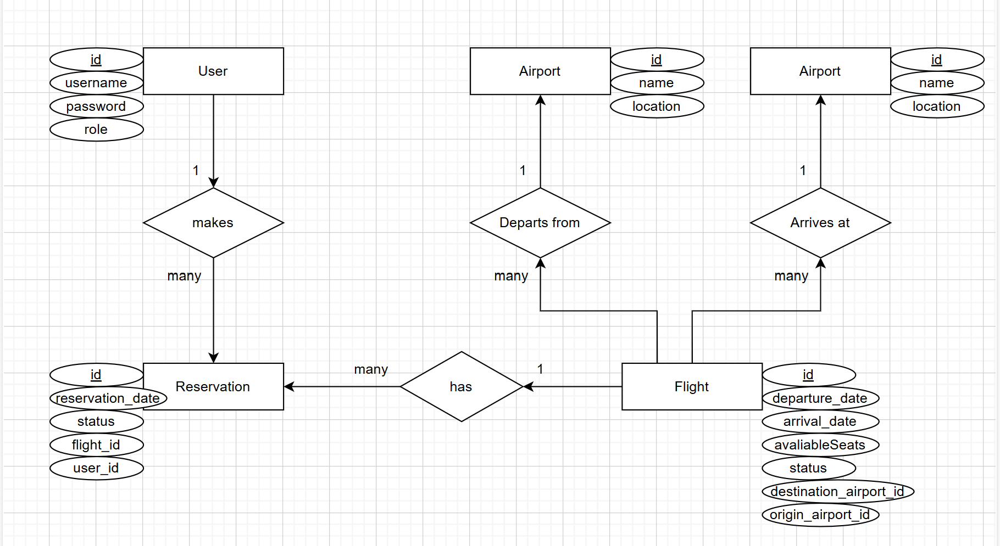

# Airline Management System

### Project Description:
The project aims to develop an airline management system using Spring with Spring Boot and Spring Security. This system will allow management of users, flights, bookings, and destinations, with advanced functionalities such as secure authentication via Basic Auth.

The system are not allow the selection of flights without available seats or those that have passed the deadline. The project are implemented using Java 21, Maven, and MySQL.

### Project Objectives:
- Reinforce the concepts of API creation.
- Apply database relationships.
- Solidify knowledge of login with Spring Security and Basic Auth.

### Functional Requirements:

#### Client Management:
- Registration, authentication, and role management (ADMIN and USER).
- Generation and validation session cookies if using Basic Auth for secure sessions.

#### Flight Management:
- Flights are automatically generated in the database at build time (via a .sql file).
- Change flight status from available to “false” when there are no available seats or when the flight is past the deadline.

#### Search Function:
- Provide the departure and destination airports, as well as the date and number of seats to reserve.

#### Reservation Management:
- Allow bookings only if the selected route exists and there is seat availability.
- Availability must be verified before confirming a reservation.
- Once the flight reservation process starts, the system should block seats for 15 minutes to ensure seat availability.

#### Actions Authorized for ADMIN Users (ADMIN):
- CRUD operations for airports.
- CRUD operations for flight routes.
- A summary list of bookings made by clients.
- The ability to obtain a list of the booking history for each user (ROLE_USER).

#### Actions Authorized for CLIENT Users (USER):
- Ability to register.
- Option to upload a profile picture; if not configured, a default picture will be shown.
- Ability to log in.
- Clients should be able to see a list of their bookings with flight information.
- Clients cannot make a reservation without logging in first.

#### Exception Management:
- Handle exceptions in a personalized way.

### Non-Functional Requirements:
- **Security:** Use of Spring Security with either Basic Auth.
- **Performance:** Optimizations such as automatic flight status changes and reservation validation to maintain system efficiency.
- **Availability:** Implement tests to ensure system stability in production.

### Public Endpoints:
- /api/auth/register: Endpoint for user registration.
- /api/auth/login: Endpoint for user login.
- /api/profile/upload: Endpoint for uploading profile images.

**ADMIN Endpoints:**
- /api/airports/*: Full CRUD operations on airports.
- /api/flights/*: Full CRUD operations on flights.
- /api/reservations/summary: Summary list of reservations.
- /api/reservations/history/*: Reservation history for each user.

**USER Endpoints:**
- /api/reservations/mine: View their own reservations with flight information.

**Authentication Requirement:**
- All other endpoints require authentication.

## How to Run
1. Clone the repository:
    ```bash
    git clone https://github.com/NelliYanchuk/java-airline-management-system.git
    ```

2. Navigate to the project directory:
    ```bash
    cd java-airline-management-system
    ```

3. Compile and run the project using your preferred Java IDE or the command line:
    ```bash
    javac src/dev/nyanchuk/airline/*.java
    java dev.nyanchuk.airline.AirlineApplication
    ```

4. To run tests, use JUnit with your preferred testing tool:
    ```bash
    java -cp .:junit.jar org.junit.runner.JUnitCore dev.nyanchuk.airline.services.FlightServiceTest
    ```

## Testing

The project uses **JUnit 5** for unit tests.

### Running Tests

To run the tests, use the following Maven command:

    mvn test

### Test Coverage



## Diagrams
- **Class Diagram**:


- **Chen Diagram**:


## Contact me with:
**Nelli Yanchuk**   [GitHub](https://github.com/NelliYanchuk) / [LinkedIn](https://www.linkedin.com/in/nelli-yanchuk-a24b81138/)
